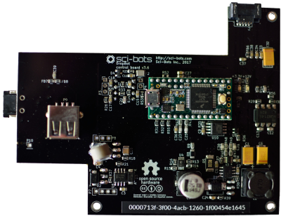
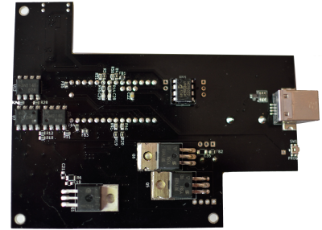

# DropBot v3 control board

The control board is a component of the [DropBot system][dropbot] responsible for:

* serial communication with the host computer (via USB)
* generation of the high-voltage driving signal (up to 140V @ < 10 kHz)
* impedance-measurement (for estimating drop position, velocity, etc.)
* control of other system hardware (e.g., switching boards)

For more information, please visit https://sci-bots.com

[][sci-bots]

This design is open-source hardware released under a [Creative Commons Attribution-ShareAlike licence][cc-by-sa].

[][cc-by-sa]

[dropbot]: https://github.com/sci-bots/dropbot-v3
[sci-bots]: https://sci-bots.com/
[cc-by-sa]: http://creativecommons.org/licenses/by-sa/3.0

